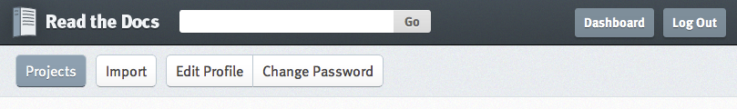
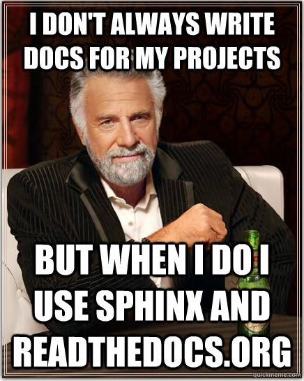

.. Sphinx Lightning Talk PyKC documentation master file, created by
   sphinx-quickstart on Mon Apr  2 09:45:48 2012.
   You can adapt this file completely to your liking, but it should at least
   contain the root `toctree` directive.

Writing docs with Sphinx & readthedocs.org
==========================================

What is Sphinx?
===============

``Sphinx is a tool that makes it easy to create intelligent and beautiful documentation, written by Georg Brandl and licensed under the BSD license.``

The main Python stdlib docs are written in Sphinx as well as other numerous Python projects.

http://sphinx.pocoo.org/index.html

Setting up a Sphinx Project
===========================

Sphinx is very easy to setup.  Make an empty project directory, make a
virtualenv and then install Sphinx into it::

    $ pip install Sphinx==1.1.3

After this has completed, run the ``sphinx-quickstart`` command.

sphinx-quickstart
=================

Run this command first to setup the project with reasonable defaults::

    $ sphinx-quickstart

All of the defaults should be fine.  I usually make sure to install the 
autodoc extension if I'm documenting code.  It's not installed by default.

After this completes, you're ready to start writing your docs! 

reStructuredText
================

Sphinx uses reStructedText for the content of your docs.  It's a bigger topic
than what I can cover here, but check out this primer on .rst

http://sphinx.pocoo.org/rest.html

Structuring your Docs
=====================

The root of your docs is the index.rst file (if you accepted the default 
from ``sphinx-quickstart``)

Here, you'll define the table of contents for your docs.  Linking to other
.rst files to create the structure.

Example toctree
===============

::

    .. toctree::
       :maxdepth: 2

       intro
       tutorial
       examples/first_example
       examples/second_example

Building your Docs
==================

Once you have your docs written use this command to build them out.  Sphinx
supports multiple output formats (html, epub, pdf, latex), but this one is for html.

::

    $ sphinx-build -b html sourcedir builddir

Or, if you used ``sphinx-quickstart`` it created a shortcut for you.

::

    $ make html

readthedocs.org
===============

Read the Docs hosts documentation for the open source community.  Created by 
Eric Holscher, Charles Leifer and Bobby Grace for the 2010 Django Dash.

You write the docs and then hook them into Read the Docs for hosting.

Use it, it's awesome.

readthedocs.org integration
===========================

It's easy, just follow these steps.

* Put your project on github.com or somewhere readthedocs.org can get to it.
* Sign up for readthedocs.org
* Import your project
* Done!

Importing your project
======================

Once you have your readthedocs.org account setup, go to your dashboard and 
click the import button.

Fill out the import form, naming the project and providing a link to the source
and click the ``Create`` button.

Your docs are now building!  Once it's done, you'll get a link to your docs.

github.com integration
======================

It's easy to setup a webhook for github to update your docs on
every push to github.

* Go to the “admin” page for your project
* Click “Service Hooks”
* In the available service hooks, click “ReadTheDocs”
* Check “Active”
* Click “Update Settings”

Thanks!
-------

https://github.com/andrewschoen/sphinx_lightning_talk

